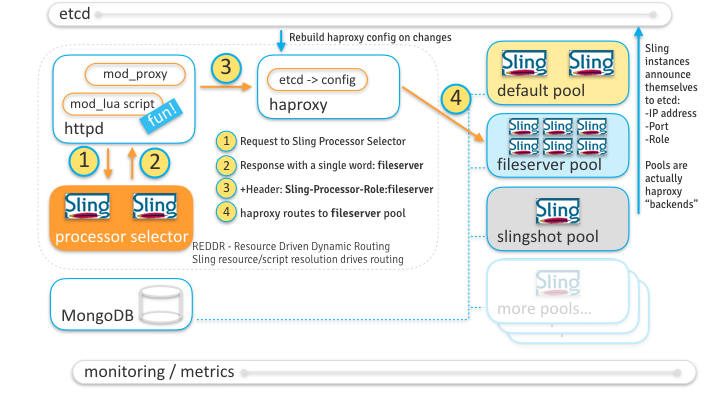

# adaptTo() 2016 -  can we run the whole Web on Sling?
This is the demo code for our http://adapt.to/2016/en/schedule/let_s-run-the-whole-web-on-apache-sling-and-oak-.html talk.

It's pretty much ready, but this README might need some reviewing.

The scripts folder has the demo scenario, but you might not understand if unless you're myself ;-)

This is obviously not production-ready.

## What's this?
This prototype demonstrates the REDDR REsource-Driven Dynamic Routing mechanism, where a specialized Sling instance drives a httpd/mod_lua/mod_proxy and haproxy combination to route HTTP requests to pools of specialized Sling instances.

The routing can use all request _and resource_ attributes that Sling uses to resolve scripts and servlets, along with HTTP method-based routing (which you can also do directly in httpd of course) and routing based on partial or full Sling resource types. All this is demonstrated below.

This drawing, from the conference slides, explains the system:

## Prerequisites
You need a Docker server and `docker-compose` setup to run this.

Unless you already have such a setup, https://www.docker.com/docker-toolbox is a good way to get started.

You Docker host needs at least 4G of memory to run this cluster comfortably. See the `docker-machine` docs
for the relevant options for your machine backend, if applicable.

After installing `docker-compose`, you can test it from this folder, as follows:

	$ docker-compose -f docker-compose-test.yml up
	
	Starting dockerslinghosting_docker-setup-test_1...
	Attaching to dockerslinghosting_docker-setup-test_1
	docker-setup-test_1 | Congratulations, your docker-compose setup works. See the docker subfolder for the actual Sling hosting setup.
	dockerslinghosting_docker-setup-test_1 exited with code 0
	Gracefully stopping... (press Ctrl+C again to force)
   
If you see the _Congratulations, ..._ message it means your `docker-compose` setup works, and
this prototype should work as well.

## Sling Docker Images
To build the required OSGi bundles and Sling Docker images, run `mvn clean install` from this folder.

This might require a few SNAPSHOT bundles from Sling, you can get the Sling code from http://github.com/apache/sling/ if needed.

## Starting the cluster
To start the cluster, build the required Docker images as shown above and then, from the `docker` 
folder found under this `README` file , assuming `localhost` points to your Docker host:

    # Remove existing state, if any
    docker-compose kill
	docker-compose rm
	
	# IF DESIRED cleanup all your Docker state
	# (including ALL OTHER volumes and containers)
	docker volume rm $(docker volume ls -q)
	docker rm $(docker ps -q -a)

    # build the Docker images - might Download the Web (tm) the first time it runs
	docker-compose build

    # start the infrastructure containers	
	docker-compose up -d etcd mongo haproxy reddr selector
	
	# Start the first Sling instance, which creates initial content
	# (the haproxy 80 and 81 ports won't respond unless that service is up)
	docker-compose up -d default
	
	# Wait for http://localhost:81/ to show the Sling launchpad page
	# See also http://localhost/haproxy/stats for HTTP routing stats
	
	# start the remaining containers
	docker-compose up -d
	
After a few seconds http://localhost should show the Sling homepage, and the below routing
test scenario should work.

If things go wrong you can use `docker-compose logs S` where S is the name of a service
as defines in the `docker-compose.yml` file.

Later you can scale up the various containers using `docker-compose scale`, if desired.	See
the comments in the `docker-compose.yml` file for which ones make sense to scale.

## Routing test scenario
The following commands demonstrate the content-driven dynamic routing:

Create some content, with a .routing script that specifies the use of 
a backend processor with the 'fileserver' role for JSON rendering:

    export H=localhost
	curl -u admin:admin -Fsling:resourceType=test http://${H}/tmp/test
    curl -u admin:admin -X POST http://${H}/cluster/routing/scripts/test
    export W=fileserver
    echo $W > /tmp/1 && curl -u admin:admin -T /tmp/1 http://${H}/cluster/routing/scripts/test/json.routing
	
Note the `Sling-Instance-Info` header in the response to this request:

    curl -D - http://${H}/tmp/test.tidy.json
	
	...
	Sling-Instance-Info: SlingId:cd4374af-6192-4a31-9daa-17a016abebd6; sling.environment.info:"sling-role:fileserver"
	...
	
Requesting the same node with an `html` extension uses the `default` processor role, as it doesn't have a specific
`.routing` script:

    curl -D - http://${H}/tmp/test.html
	
    ...
	Sling-Instance-Info: SlingId:077141a0-63c0-4ab8-b5a4-b33782326000; sling.environment.info:"sling-role:default"	
	...

## Dynamic HTTP request routing via the "selector" Sling instance
This routing is driven by the _selector_ Sling processor instance, that a Lua script configured in the _reddr_ HTTP front-end service calls to find out which processor to proxy the request to.

Like all our processors, this _selector_ can be called by adding a _Sling-Processor-Role_ header to a request on port 81, so the following two requests explain why the _fileserver_ and _default_ processors are used for the above requests:

    curl -H Sling-Processor-Role:selector http://${H}:81/tmp/test.tidy.json
    fileserver
    
    curl -H Sling-Processor-Role:selector http://${H}:81/tmp/test.html
    default
    
The _selector_ processor replies with just one word which is the name of the processor to use, driven by the usual Sling script resolution rules, enhanced with some method and resource type selection described below. This is implemented in our `processor-selector` bundle.
    
## Routing test scenario, continued

Routing can also be defined by HTTP method, here we route all PUT requests to the 'fileserver' processor, as well
as GET requests to files:

    curl -u admin:admin -F"sling:processorRole=fileserver" http://${H}/cluster/routing/methods/PUT
	echo fileserver > /tmp/1
	curl -u admin:admin -X POST http://${H}/cluster/routing/scripts/nt/file
	curl -u admin:admin -T /tmp/1 http://${H}/cluster/routing/scripts/nt/file/GET.routing
	
Now the following requests are handled by the 'fileserver' processor, except for the POST used
to create the test path:

    echo "not an image but you get the idea" > /tmp/1
    curl -D - -u admin:admin -T /tmp/1 http://${H}/tmp/fakeimage.jpg
    curl -u admin:admin -X POST http://${H}/some/other/path
    # (might need to wait a bit here, eventual consistency between both instances)
    curl -D - -u admin:admin -T /tmp/1 http://${H}/some/other/path/somefile.txt
    ...sling.environment.info:"sling-role:fileserver-6075c6d0b7c6"	
	
    curl -D - http://${H}/tmp/fakeimage.jpg
    ...sling.environment.info:"sling-role:fileserver-6075c6d0b7c6"	
    
    curl -D - http://${H}/some/other/path/somefile.txt
    ...sling.environment.info:"sling-role:fileserver-6075c6d0b7c6"	

Finally, setting `sling:`processorRole` property in the content also defines a processor role, either on the resource or
its ancestors:

    curl -u admin:admin -F sling:processorRole=fileserver http://${H}/tmp
	
	curl -D - http://${H}/tmp/test.html
	...
	Sling-Instance-Info: SlingId:cd4374af-6192-4a31-9daa-17a016abebd6; sling.environment.info:"sling-role:fileserver"
	...	

## Application-specific processors: Slingshot example
By default, the http://localhost/slingshot.html page does not work in our demo, it gives a JSP compilation error as 
the default processor does not have the required `slingshot` demo bundle.

Routing all the requests for resources having a resource type that starts with `slingshot` fixes this:

    curl -u admin:admin -X POST -F sling:processorRole=slingshot http://${H}/cluster/routing/resource-types/slingshot
	
With this setting, the slingshot.html page should show its nice Manhattan sailboat image, generated by a script
that only works on the `slingshot` Sling processor instance.

Note that if the above settings are still active, the `nt:file` resources of that page are still served by the
`fileserver` request processor.

## Load test scenario
(We haven't used this in our presentation in the end)

The following requests can currently be used to generate load (example with the alpha.example.com test host):

    $ curl -u admin:admin http://localhost/at16.txt
    /at16 has 0 descendant nodes with an 'id' property.
    
    $ curl -u admin:admin -X POST http://localhost/at16.txt
    Added /at16/RootPostServlet/10/08/1008a470-42c8-432a-a7e3-73dd006e4497
    
    $ curl -u admin:admin -X POST http://localhost/at16.txt
    Added /at16/RootPostServlet/a4/f5/a4f5e869-9d99-4322-ba4c-0ffcc7474e1c
    
    $ curl -u admin:admin -X POST http://localhost/at16.txt
    Added /at16/RootPostServlet/e3/c1/e3c113c9-6374-48c6-b5b1-b3a42cdfb7dc
    
    $ curl -u admin:admin http://localhost/at16.txt
    /at16 has 3 descendant nodes with an 'id' property.
    
    $ ab -A admin:admin -p /dev/null -n 100 http://localhost/at16.txt
    This is ApacheBench, Version 2.3 <$Revision: 1706008 $>
	...
    Benchmarking alpha.example.com (be patient).....done
    Requests per second:    74.09 [#/sec] (mean)
	...
    
    $ curl -u admin:admin http://alpha.example.com/at16.txt
    /at16 has 103 descendant nodes with an 'id' property.

Metrics are available at http://localhost/system/console/slingmetrics - if several Sling instances are active this will hit each a different one every time due to the `haproxy` round-robin setup.

## Troubleshooting tips
To see the logs of the `reddr` service which dispatches requests to the Sling processors, use `docker-compose logs -f reddr`

http://localhost:81 proxies the Sling processors, based on the `Sling-Processor-Host` header value. To access a specific processor from a browser (or set of processors if several are up for the same role), use a browser plugin that allows for setting this additional HTTP header. The `default` processor is used by default (obviously), and the webconsole of the processors show an ID like `sling-role:default-3bfa11f943d8` indicating the configured role and container hostname which is the Docker container ID by default.

The Composum browser is available at http://localhost/bin/browser.html

## ELK Integration

This setup also configures the ELK stack (Elasticsearch, Kibana and Logstash). Kibana is used to visualize the metrics
stats. Each sling instance has a Metric ES Reporter configured which periodically send the local metrics to ES server.
Those metrics can then be visualized in Kibana

Kibana server can be accessed at http://localhost:5601. Index related to metrics data can be accessed at http://localhost:9200/_cat/indices

TODO Saved Kibana Visualization
